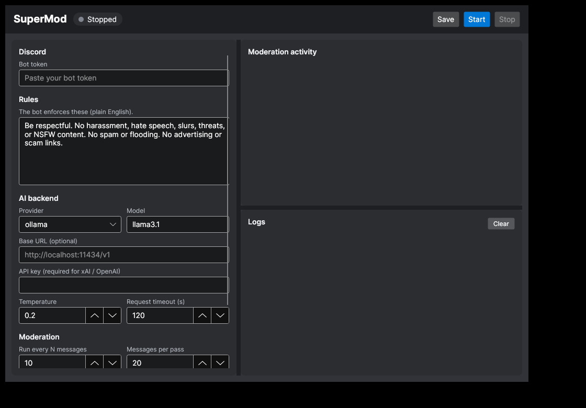

# SuperMod

An AI-powered moderator for Discord that follows the rules **you** write — with
a native desktop app to run it.

You create a Discord bot, give SuperMod a set of rules in plain English, and
point it at a language model (local or hosted). SuperMod watches every channel,
and on a rolling basis sends recent messages to the model. The model decides —
using real moderation tools — whether to **delete messages** and/or **time out
users**, then SuperMod carries those actions out.

The whole thing is driven from a desktop window: fill in your token, rules and
backend, click **Start**, and watch the live moderation feed.



## How it works

```
Discord message ──► per-channel buffer ──(every 10 messages)──► last 20 messages
                                                                      │
                                                                      ▼
                              system prompt (your rules) + transcript ──► AI model
                                                                      │
                                              tool calls: delete_messages / timeout_users
                                                                      ▼
                                                      SuperMod executes them on Discord
```

- **Rolling review.** Each channel keeps a buffer of the **20** most recent
  messages. Every **10** new messages, SuperMod sends the current window to the
  model. Because the window (20) is twice the step (10), each pass overlaps the
  previous one by 10 messages — the model always sees the 10 newest messages
  plus the 10 it saw last time, so it keeps context across passes. Both numbers
  are configurable.
- **Acts on startup.** As soon as it connects, SuperMod runs one immediate pass
  over the most recent messages in a random channel it can read — so it starts
  moderating right away instead of waiting for new activity to accumulate.
- **Tools, not guesswork.** The model is given two functions —
  `delete_messages` and `timeout_users` — each of which accepts multiple ids, so
  a single decision can clean up several messages and mute several users at once.
- **One client, three backends.** LM Studio, Ollama and xAI all speak the
  OpenAI-compatible `/v1/chat/completions` API with tool calling, so SuperMod
  uses a single HTTP client for all of them.

## Requirements

- [.NET 8 SDK](https://dotnet.microsoft.com/download)
- A Discord bot (see below)
- One AI backend: **LM Studio**, **Ollama**, or an **xAI API key**

## 1. Create the Discord bot

1. Go to the [Discord Developer Portal](https://discord.com/developers/applications) → **New Application**.
2. Open **Bot** → **Reset Token** and copy the token (this is your `DiscordToken`).
3. Under **Privileged Gateway Intents**, enable **Message Content Intent**
   (SuperMod needs to read message text).
4. Invite the bot with the **Moderate Members** and **Manage Messages**
   permissions (OAuth2 → URL Generator → scopes `bot`, then tick those two).
   Make sure the bot's role sits **above** the members it should be able to moderate.

## 2. Pick an AI backend

| Provider  | Default base URL                | API key  | Example model      |
|-----------|---------------------------------|----------|--------------------|
| Ollama    | `http://localhost:11434/v1`     | not used | `llama3.1`         |
| LM Studio | `http://localhost:1234/v1`      | not used | (loaded model)     |
| xAI       | `https://api.x.ai/v1`           | required | `grok-2-latest`    |

- **Ollama:** `ollama pull llama3.1` then `ollama serve`. Use a model that
  supports tool calling (e.g. `llama3.1`, `qwen2.5`, `mistral-nemo`).
- **LM Studio:** load a tool-capable model and start the **Local Server**.
- **xAI:** create an API key at <https://console.x.ai>.

> Tool calling quality depends on the model. Small local models can be hit or
> miss; larger instruct models follow the rules far more reliably.

## 3. Run the app

```bash
dotnet run --project src/SuperMod.App
```

The SuperMod window opens. Then:

1. Paste your **bot token**.
2. Edit the **rules** (plain English — the defaults are a reasonable starting point).
3. Choose your **AI backend**: provider, model, and an API key if using xAI.
   Leave **Base URL** blank to use the provider's default (shown as a hint).
4. Tune **moderation** settings if you like (how often it runs, window size,
   max timeout, dry-run, protect-moderators).
5. Click **Start**. The status dot turns green and the live **Moderation
   activity** and **Logs** panels fill in as the bot works. Click **Stop** any time.

Your settings are saved automatically (on **Save** or **Start**) to
`config.json` in your user app-data folder — `%APPDATA%\SuperMod` on Windows,
`~/.config/SuperMod` on Linux, `~/Library/Application Support/SuperMod` on macOS —
so they're remembered next launch. The token and API key are stored there in
plain text, so treat that folder accordingly.

Tip: tick **Dry run** the first time. SuperMod logs exactly what it *would*
delete or time out without touching anyone, so you can sanity-check your rules
and model before going live.

## Safety

- **Protected members:** with **"Never time out owner / admins / mods"** on
  (default), SuperMod never times out the guild owner or anyone with
  Administrator, Manage Messages or Moderate Members permissions. It also never
  times out itself.
- **Timeout cap:** every timeout is clamped to **Max timeout (minutes)** and to
  Discord's hard 28-day limit.
- **Dry run:** performs no destructive actions — actions are only logged.
- **Self-throttling:** only one moderation pass runs per channel at a time;
  overlapping triggers are skipped rather than queued.

## Tests

```bash
dotnet test
```

Covers the rolling-window/overlap logic, prompt building, tolerant tool-argument
parsing (string *or* numeric ids, string-encoded arguments), the moderation
dispatch pipeline (timeout/delete/clamping/failure handling), the
OpenAI-compatible HTTP request/response wire format, and the desktop
view-model (config load/save, start/stop, status & feed updates) — all without
needing a live Discord connection, model, or display.

## Project layout

```
src/SuperMod.Core/      Discord-free, fully testable engine
  Configuration/          Strongly-typed options + validation
  Ai/                     OpenAI-compatible chat client + DTOs
  Moderation/             Buffer, prompt, tools, dispatch
  Discord/                Gateway runner (BotRunner) + action implementation
src/SuperMod.App/       Avalonia desktop UI
  Views/                  MainWindow (XAML)
  ViewModels/             MainWindowViewModel (bindable state + commands)
  Services/               Bot controller, config store, UI log sink
  Converters/             Status / log-level colours
tests/SuperMod.Tests/   xUnit test suite (engine + view-model)
```

The engine in `SuperMod.Core` depends only on the `IChatClient` and
`IModerationActions` abstractions, never on Avalonia — and the view-model talks
to the bot through `IBotController` — which is what makes both the moderation
pipeline and the UI logic testable in isolation.

Built with [Avalonia](https://avaloniaui.net) (cross-platform: Windows, macOS,
Linux) and [Discord.Net](https://discordnet.dev).
